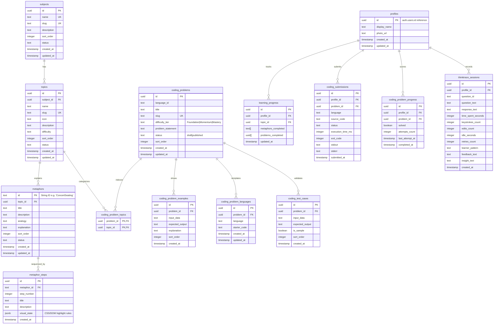

# LearnTrace — Final Database Schema Specification

This document defines the production-ready Supabase PostgreSQL schema for the LearnTrace platform, detailing tables, naming standards, RLS policies, indexing, and the database seeding strategy.

---

## 1. Relational Entity Relationship Diagram

---

## 2. Table-by-Table Schema Specification

### 2.1. `subjects`
* **Columns**:
  * `id` (`uuid`, PRIMARY KEY, DEFAULT `gen_random_uuid()`)
  * `name` (`text`, UNIQUE, NOT NULL)
  * `slug` (`text`, UNIQUE, NOT NULL)
  * `description` (`text`)
  * `sort_order` (`integer`, NOT NULL, DEFAULT 0)
  * `status` (`text`, NOT NULL, DEFAULT 'published')
  * `created_at` (`timestamp with time zone`, DEFAULT `now()`)
  * `updated_at` (`timestamp with time zone`, DEFAULT `now()`)
* **RLS**: Read `PUBLIC`, Write `ADMIN ONLY`.

### 2.2. `topics`
* **Columns**:
  * `id` (`uuid`, PRIMARY KEY, DEFAULT `gen_random_uuid()`)
  * `subject_id` (`uuid`, NOT NULL, FOREIGN KEY REFERENCES `subjects.id` ON DELETE CASCADE)
  * `name` (`text`, NOT NULL)
  * `slug` (`text`, UNIQUE, NOT NULL)
  * `icon` (`text`)
  * `description` (`text`)
  * `difficulty` (`text`, NOT NULL, DEFAULT 'Beginner')
  * `sort_order` (`integer`, NOT NULL, DEFAULT 0)
  * `status` (`text`, NOT NULL, DEFAULT 'published')
  * `created_at` (`timestamp with time zone`, DEFAULT `now()`)
  * `updated_at` (`timestamp with time zone`, DEFAULT `now()`)
* **RLS**: Read `PUBLIC`, Write `ADMIN ONLY`.

### 2.3. `metaphors`
* **Columns**:
  * `id` (`text`, PRIMARY KEY)
  * `topic_id` (`uuid`, NOT NULL, FOREIGN KEY REFERENCES `topics.id` ON DELETE CASCADE)
  * `title` (`text`, NOT NULL)
  * `description` (`text`)
  * `analogy` (`text`)
  * `explanation` (`text`)
  * `sort_order` (`integer`, NOT NULL, DEFAULT 0)
  * `status` (`text`, NOT NULL, DEFAULT 'published')
  * `created_at` (`timestamp with time zone`, DEFAULT `now()`)
  * `updated_at` (`timestamp with time zone`, DEFAULT `now()`)
* **RLS**: Read `PUBLIC`, Write `ADMIN ONLY`.

### 2.4. `metaphor_steps`
* **Columns**:
  * `id` (`uuid`, PRIMARY KEY, DEFAULT `gen_random_uuid()`)
  * `metaphor_id` (`text`, NOT NULL, FOREIGN KEY REFERENCES `metaphors.id` ON DELETE CASCADE)
  * `step_number` (`integer`, NOT NULL)
  * `title` (`text`)
  * `description` (`text`)
  * `visual_state` (`jsonb`)
  * `created_at` (`timestamp with time zone`, DEFAULT `now()`)
* **RLS**: Read `PUBLIC`, Write `ADMIN ONLY`.
* **Unique Constraints**: `UNIQUE (metaphor_id, step_number)`.

### 2.5. `coding_problems`
Stores practice problems for coding challenges.
* **Columns**:
  * `id` (`uuid`, PRIMARY KEY, DEFAULT `gen_random_uuid()`)
  * `language_id` (`text`, NOT NULL) — e.g. `'python'`, `'cpp'`
  * `title` (`text`, NOT NULL)
  * `slug` (`text`, UNIQUE, NOT NULL)
  * `difficulty_tier` (`text`, NOT NULL, DEFAULT 'Foundation') — `'Foundation' | 'Momentum' | 'Mastery'`
  * `problem_statement` (`text`, NOT NULL)
  * `status` (`text`, NOT NULL, DEFAULT 'published')
  * `sort_order` (`integer`, NOT NULL, DEFAULT 0)
  * `created_at` (`timestamp with time zone`, DEFAULT `now()`)
  * `updated_at` (`timestamp with time zone`, DEFAULT `now()`)
* **RLS**: Read `PUBLIC`, Write `ADMIN ONLY`.

### 2.6. `coding_problem_topics`
Junction table mapping coding problems to multiple topics.
* **Columns**:
  * `problem_id` (`uuid`, FOREIGN KEY REFERENCES `coding_problems.id` ON DELETE CASCADE)
  * `topic_id` (`uuid`, FOREIGN KEY REFERENCES `topics.id` ON DELETE CASCADE)
  * PRIMARY KEY (`problem_id`, `topic_id`)
* **RLS**: Read `PUBLIC`, Write `ADMIN ONLY`.

### 2.7. `coding_problem_examples`
Stores illustrative input/output samples.
* **Columns**:
  * `id` (`uuid`, PRIMARY KEY, DEFAULT `gen_random_uuid()`)
  * `problem_id` (`uuid`, NOT NULL, FOREIGN KEY REFERENCES `coding_problems.id` ON DELETE CASCADE)
  * `input_data` (`text`, NOT NULL)
  * `expected_output` (`text`, NOT NULL)
  * `explanation` (`text`)
  * `sort_order` (`integer`, NOT NULL, DEFAULT 0)
  * `created_at` (`timestamp with time zone`, DEFAULT `now()`)
* **RLS**: Read `PUBLIC`, Write `ADMIN ONLY`.

### 2.8. `coding_problem_languages`
Stores language-specific templates/starter code.
* **Columns**:
  * `id` (`uuid`, PRIMARY KEY, DEFAULT `gen_random_uuid()`)
  * `problem_id` (`uuid`, NOT NULL, FOREIGN KEY REFERENCES `coding_problems.id` ON DELETE CASCADE)
  * `language` (`text`, NOT NULL)
  * `starter_code` (`text`, NOT NULL)
  * `created_at` (`timestamp with time zone`, DEFAULT `now()`)
  * `updated_at` (`timestamp with time zone`, DEFAULT `now()`)
* **RLS**: Read `PUBLIC`, Write `ADMIN ONLY`.
* **Unique Constraints**: `UNIQUE (problem_id, language)`.

### 2.9. `coding_test_cases`
Stores hidden judge and public validation test cases.
* **Columns**:
  * `id` (`uuid`, PRIMARY KEY, DEFAULT `gen_random_uuid()`)
  * `problem_id` (`uuid`, NOT NULL, FOREIGN KEY REFERENCES `coding_problems.id` ON DELETE CASCADE)
  * `input_data` (`text`, NOT NULL)
  * `expected_output` (`text`, NOT NULL)
  * `is_sample` (`boolean`, DEFAULT false)
  * `sort_order` (`integer`, NOT NULL, DEFAULT 0)
  * `created_at` (`timestamp with time zone`, DEFAULT `now()`)
* **RLS**: 
  * Read: `is_sample = true` OR user is `admin`. (Hidden outputs are NOT exposed to normal public user select queries).
  * Write: `ADMIN ONLY`.

### 2.10. `profiles`
* **Columns**:
  * `id` (`uuid`, PRIMARY KEY, FOREIGN KEY REFERENCES `auth.users.id` ON DELETE CASCADE)
  * `display_name` (`text`)
  * `photo_url` (`text`)
  * `created_at` (`timestamp with time zone`, DEFAULT `now()`)
  * `updated_at` (`timestamp with time zone`, DEFAULT `now()`)
* **RLS**: Read `PUBLIC`, Write `OWNER ONLY`.

### 2.11. `learning_progress`
* **Columns**:
  * `id` (`uuid`, PRIMARY KEY, DEFAULT `gen_random_uuid()`)
  * `profile_id` (`uuid`, NOT NULL, FOREIGN KEY REFERENCES `profiles.id` ON DELETE CASCADE)
  * `topic_id` (`uuid`, NOT NULL, FOREIGN KEY REFERENCES `topics.id` ON DELETE CASCADE)
  * `metaphors_completed` (`text[]`, DEFAULT '{}')
  * `problems_completed` (`uuid[]`, DEFAULT '{}')
  * `updated_at` (`timestamp with time zone`, DEFAULT `now()`)
* **RLS**: Read `OWNER ONLY`, Write/Update `OWNER ONLY`.
* **Unique Constraints**: `UNIQUE (profile_id, topic_id)`.

### 2.12. `coding_submissions`
Logs user programming solution submissions.
* **Columns**:
  * `id` (`uuid`, PRIMARY KEY, DEFAULT `gen_random_uuid()`)
  * `profile_id` (`uuid`, NOT NULL, FOREIGN KEY REFERENCES `profiles.id` ON DELETE CASCADE)
  * `problem_id` (`uuid`, NOT NULL, FOREIGN KEY REFERENCES `coding_problems.id` ON DELETE CASCADE)
  * `language` (`text`, NOT NULL)
  * `source_code` (`text`, NOT NULL)
  * `status` (`text`, NOT NULL) — e.g. `'accepted' | 'wrong_answer' | 'compile_error' | 'runtime_error' | 'pending'`
  * `execution_time_ms` (`integer`)
  * `exit_code` (`integer`)
  * `stdout` (`text`)
  * `stderr` (`text`)
  * `submitted_at` (`timestamp with time zone`, DEFAULT `now()`)
* **RLS**: Read `OWNER ONLY`, Write `OWNER ONLY`.

### 2.13. `coding_problem_progress`
Tracks user completion and metrics for practice tasks.
* **Columns**:
  * `id` (`uuid`, PRIMARY KEY, DEFAULT `gen_random_uuid()`)
  * `profile_id` (`uuid`, NOT NULL, FOREIGN KEY REFERENCES `profiles.id` ON DELETE CASCADE)
  * `problem_id` (`uuid`, NOT NULL, FOREIGN KEY REFERENCES `coding_problems.id` ON DELETE CASCADE)
  * `solved` (`boolean`, DEFAULT false)
  * `attempts_count` (`integer`, NOT NULL, DEFAULT 0)
  * `last_attempt_at` (`timestamp with time zone`, DEFAULT `now()`)
  * `completed_at` (`timestamp with time zone`)
* **RLS**: Read `OWNER ONLY`, Write `OWNER ONLY`.
* **Unique Constraints**: `UNIQUE (profile_id, problem_id)`.

### 2.14. `thinktrace_sessions`
* **Columns**:
  * `id` (`uuid`, PRIMARY KEY, DEFAULT `gen_random_uuid()`)
  * `profile_id` (`uuid`, NOT NULL, FOREIGN KEY REFERENCES `profiles.id` ON DELETE CASCADE)
  * `question_id` (`text`, NOT NULL)
  * `question_text` (`text`, NOT NULL)
  * `response_text` (`text`, NOT NULL)
  * `time_spent_seconds` (`integer`, NOT NULL)
  * `keystrokes_count` (`integer`, NOT NULL)
  * `edits_count` (`integer`, NOT NULL)
  * `idle_seconds` (`integer`, NOT NULL)
  * `retries_count` (`integer`, NOT NULL)
  * `learner_pattern` (`text`)
  * `feedback_text` (`text`)
  * `insight_text` (`text`)
  * `created_at` (`timestamp with time zone`, DEFAULT `now()`)
* **RLS**: Read `OWNER ONLY`, Write `OWNER ONLY`.

---

## 3. Secure Execution Architecture (Security Model)

To evaluate user submissions safely without exposing hidden judge outputs:
1. **Frontend**: Submits source code to a secure API proxy backend (`/api/run` or equivalent serverless function).
2. **Execution Runner**:
   * The secure endpoint retrieves all test cases for the problem from `coding_test_cases` using high-privilege service-role credentials.
   * Runs the code inside an isolated, sandboxed environment (e.g. Docker container, Piston API runtime, or secure microVM).
   * Compares execution outputs with expected outputs.
3. **Database Logging**: Writes the final verification metrics directly to `coding_submissions` and updates `coding_problem_progress`. Returning only stdout/stderr metrics back to the client.
